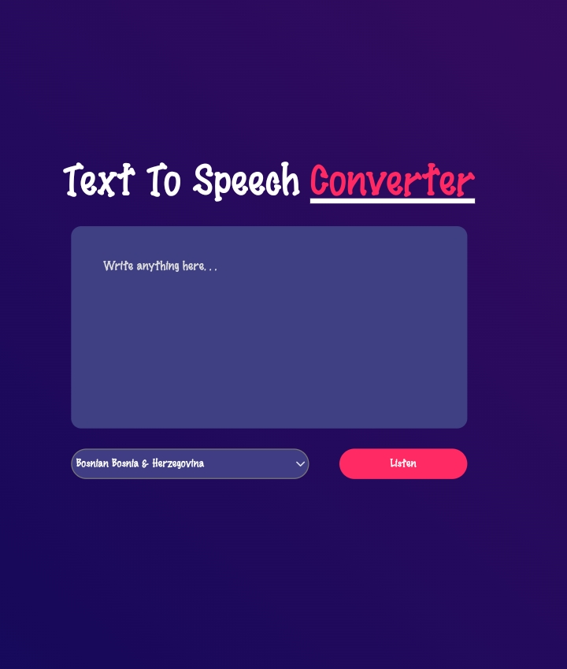

# Text-to-Speech Converter

## Overview
The Text-to-Speech Converter is a web application that allows users to convert written text into speech. With a user-friendly interface and interactive features, users can easily input text and listen to virtual speech in their preferred language.

## Features
- **Text Input:** Input any written text into the application.
- **Language Selection:** Choose the language of the input text and the desired language for speech output.
- **Speech Output:** Listen to virtual speech generated from the input text.
- **Customization Options:** Adjust volume, speed, and pitch of the speech output.
- **Responsive Design:** Ensures optimal experience across devices.

## Technologies Used
- **HTML:** Structure and content markup.
- **CSS:** Styling and layout design.
- **JavaScript:** Interactivity and speech synthesis functionality.
- **SpeechSynthesis API:** Provides the ability to convert text into speech.
- **Responsive Design:** Ensures the application is accessible on various devices.

## Visit the Website
Experience the Text-to-Speech Converter live [here](https://neptech-roshan.github.io/Text-To-Speech-Converter/).

## Screenshots

## Contributing
Contributions are welcome! If you have any suggestions for improving the application or adding new features, feel free to submit issues or pull requests.

## Copyright 
This project is licensed under the [MIT License]
-Roshan

